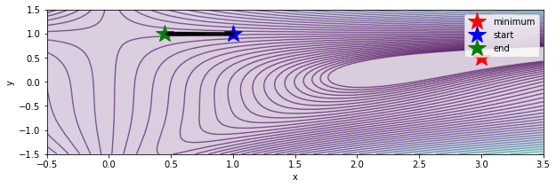
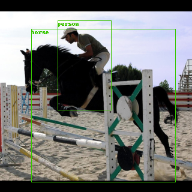
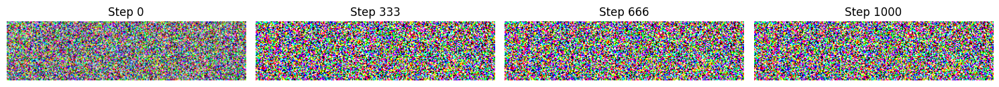
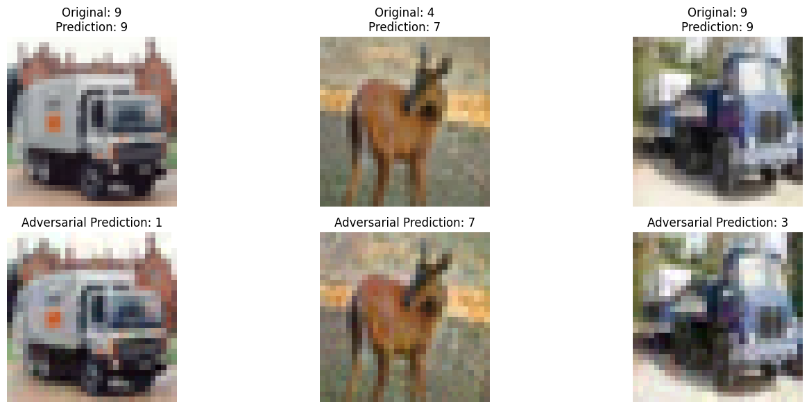
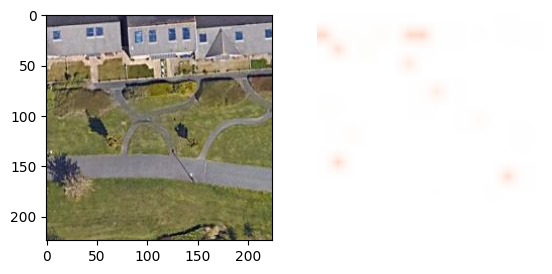
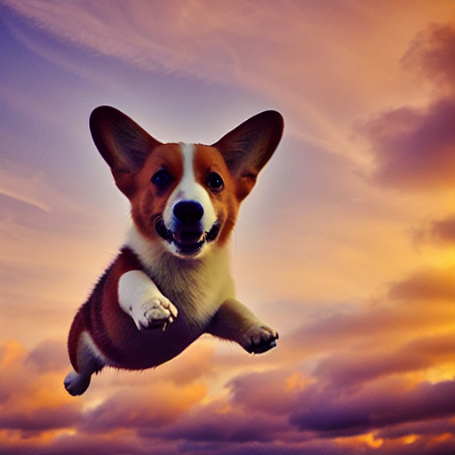
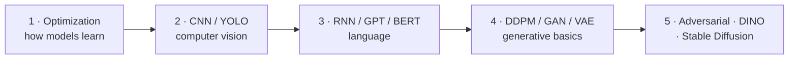

# 🧠 Deep Learning — A Hands-On Journey

**Deep Learning Course · Sharif University of Technology**
**Instructor:** Prof. Mahdiyeh Soleymani

This repository walks through deep learning from the ground up — from training the tiniest neural network by hand to generating brand-new images with **Stable Diffusion**. Each assignment is a self-contained, runnable notebook.

> 📘 **New to deep learning?** Every topic below starts with a **"💡 In plain English"** box that explains the idea with no math and no jargon — so you can follow along even if you've never trained a model.

---

## 🗺️ What's inside

| # | Assignment | Topics | One-line idea |
|---|-----------|--------|---------------|
| 1 | [Optimization & PyTorch](#1️⃣-optimization-pytorch-and-neural-networks) | SGD, Adam, NN from scratch | How models *learn* |
| 2 | [YOLO, CNN & Colorization](#2️⃣-yolo-cnn-and-colorization) | Object detection, image classification | Teaching computers to *see* |
| 3 | [GPT, RNN & BERT](#3️⃣-gpt-rnn-and-bert) | Language models | Teaching computers to *read & write* |
| 4 | [DDPM & GAN-VAE](#4️⃣-ddpm-and-gan-vae) | Diffusion, GANs, VAEs | Teaching computers to *imagine* |
| 5 | [Adversarial, DINO & Stable Diffusion](#5️⃣-adversarial-dino-and-stable-diffusion) | Robustness, self-supervision, text-to-image | The cutting edge |

---

## 1️⃣ Optimization, PyTorch, and Neural Networks

> 💡 **In plain English:** A neural network "learns" by repeatedly tweaking millions of internal knobs to reduce its mistakes. **Optimization** is the *strategy* for turning those knobs. Picture a hiker in fog trying to reach the lowest point of a valley by always stepping downhill — that's gradient descent. Algorithms like **Adam** and **RMSProp** are smarter hikers that adjust their step size automatically.

<p align="center"><br><em>An optimizer rolling downhill across a 2-D loss surface — from the start point to the minimum.</em></p>

**What this assignment covers:**
- **Optimization algorithms** — implementing SGD, Adam, and RMSProp and watching them navigate tricky benchmark surfaces (Ackley, Beale).
- **A neural network from scratch** — building forward- and back-propagation with only NumPy, so the "magic" of training is fully transparent.
- **PyTorch fundamentals** — tensors, autograd (automatic gradients), and the training loop you'll reuse everywhere.

📂 [`1- Optimization and PyTorch/`](./1-%20Optimization%20and%20PyTorch)

---

## 2️⃣ YOLO, CNN, and Colorization

> 💡 **In plain English:** A **Convolutional Neural Network (CNN)** is the workhorse of computer vision — it scans an image with small "filters" that detect edges, then shapes, then whole objects. **YOLO ("You Only Look Once")** is a famously fast detector that looks at a picture a single time and instantly draws boxes around everything it recognizes.

<p align="center"><br><em>YOLO detecting a <strong>person</strong> and a <strong>horse</strong> in one pass.</em></p>

**What this assignment covers:**
- **Image classification** with CNNs on CIFAR-10 (sorting photos into categories).
- **Object detection** with YOLO (finding *where* objects are, not just *what*).
- **Colorization** — a model that takes a black-and-white photo and predicts realistic colors for it.

📂 [`2- Yolo, CNN, and Colorization/`](./2-%20Yolo,%20CNN,%20and%20Colorization)

---

## 3️⃣ GPT, RNN, and BERT

> 💡 **In plain English:** These are models that understand and produce **language**.
> - An **RNN** reads text one word at a time, keeping a short "memory" of what it just saw — good for sequences.
> - **GPT** is a model that predicts the next word over and over, which is how it writes whole paragraphs (it's the family behind ChatGPT).
> - **BERT** reads a sentence in *both* directions at once to deeply understand meaning — great for tasks like answering questions or judging sentiment.

**What this assignment covers:**
- **RNNs / LSTMs** for sequence modeling and text generation.
- A **simple GPT** built and trained to generate coherent text.
- **BERT** fine-tuned for masked-language-modeling and sentence classification.

📂 [`3- GPT, RNN, and BERT/`](./3-%20GPT,%20RNN,%20and%20BERT)

---

## 4️⃣ DDPM and GAN-VAE

> 💡 **In plain English — what's a diffusion model?** Imagine taking a clear photo and adding a little "TV static" again and again until it's *pure noise*. A **diffusion model (DDPM)** learns to run that process **backwards**: starting from random noise, it removes a little static at each step until a brand-new, realistic image appears. The picture below shows the *forward* (noising) direction the model learns to reverse.

<p align="center"><br><em>Forward diffusion: a clean image is gradually destroyed into noise (step 0 → 1000). Generation runs this in reverse.</em></p>

> 💡 **GANs vs. VAEs (two other ways to "imagine" images):**
> - A **GAN** is two networks playing cat-and-mouse: a *generator* makes fake images while a *critic* tries to spot the fakes — both improve until the fakes look real.
> - A **VAE** learns to squeeze an image into a small "code" and rebuild it, which lets you smoothly generate and blend new images.

**What this assignment covers:** implementing a **DDPM** from scratch, and building a **GAN** and a **VAE** to compare how different generative models create images.

📂 [`4- DDPM and GAN-VAE/`](./4-%20DDPM%20and%20GAN-VAE)

---

## 5️⃣ Adversarial, DINO, and Stable Diffusion

> 💡 **Adversarial attacks:** You can add a tiny, almost invisible amount of noise to an image and completely fool a neural network — it will confidently call a truck a "deer." Studying these attacks (and defenses) makes models more **robust**.

<p align="center"><br><em>Top: original images, correctly classified. Bottom: after a tiny adversarial nudge, the same model is fooled.</em></p>

> 💡 **DINO (self-supervised learning):** Normally models learn from human-labeled data. **DINO** learns *without labels* — yet it spontaneously figures out where the objects are. Its internal "attention" can be visualized as a heatmap that highlights the main subject.

<p align="center"><br><em>Left: input image. Right: DINO's attention — it found the salient regions on its own, with no labels.</em></p>

> 💡 **Stable Diffusion (text → image):** A diffusion model (see assignment 4) guided by a **text prompt**, so you can type a description and it paints a matching picture from noise.

<p align="center"><br><em>Generated by Stable Diffusion — e.g. "a corgi flying through a sunset sky."</em></p>

**What this assignment covers:** crafting and defending against **adversarial examples**, exploring **DINO** self-supervised vision transformers, and generating images with **Stable Diffusion**.

📂 [`5- Adversarial, Dino, and StabeDiffusion/`](./5-%20Adversarial,%20Dino,%20and%20StabeDiffusion)

---

## 🚀 Getting Started

The assignments are Jupyter notebooks, mostly built for **Google Colab** (free GPU).

```bash
git clone https://github.com/mjmaher987/Deep-Learning.git
cd Deep-Learning

# common dependencies
pip install torch torchvision numpy matplotlib transformers diffusers
```

Open any assignment's notebook and run the cells top-to-bottom. Start with **Assignment 1** if you're new — it builds the foundations the later ones rely on.

---

## 🛠️ Tech Stack

- **Framework:** PyTorch (+ torchvision)
- **NLP:** Hugging Face Transformers (GPT, BERT)
- **Generative:** custom DDPM/GAN/VAE, Stable Diffusion (`diffusers`)
- **Tooling:** NumPy, Matplotlib, Google Colab

---

## 🎓 Suggested Learning Path



Each step builds on the previous one — by the end you'll understand how a single idea (a network learning from data) scales all the way up to generating images from text.
